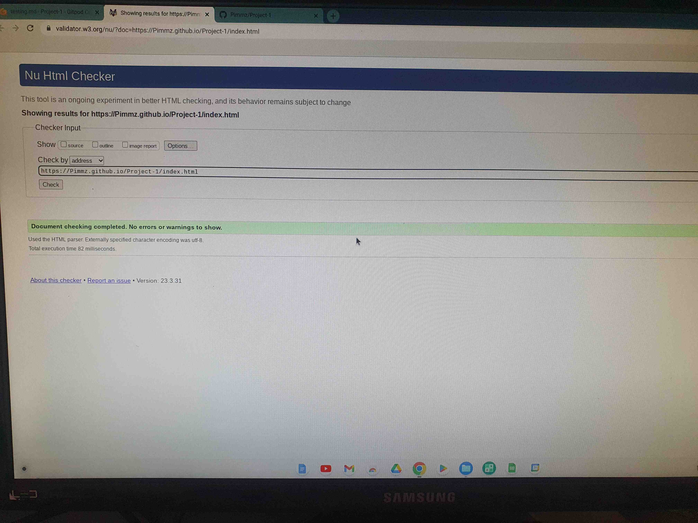

# Walkies Testing

Return back to the [README.md](README.md) file.

To ensure that Walkies works effectively over a number of sites and devices, I have prepared details and screenshots for you to see the testing I have done to ensure it is very reliable..

## Code Validation

HTML Validation

I have used the recommended [HTML W3C Validator](https://validator.w3.org) to validate all of my HTML files.

Below is a link for you too see live that my code is valid plus I have enclosed a screenshot in case for some reason that fails;

| Page | W3C URL | Screenshot | Notes |
| --- | --- | --- | --- |
| Home | [W3C](https://validator.w3.org/nu/?doc=https%3A%2F%2FPimmz.github.io%2FProject-1%2Findex.html) |
| Services | [W3C](https://validator.w3.org/nu/?doc=https%3A%2F%2FPimmz.github.io%2FProject-1%2Fservices.html) 
| Contact | [W3C](https://validator.w3.org/nu/?doc=https%3A%2F%2FPimmz.github.io%2FProject-1%2Fcontact.html) | 
| Review | [W3C](https://validator.w3.org/nu/?doc=https%3A%2F%2FPimmz.github.io%2FProject-1%2Freviews.html) | 
|  Errors |
| Add Blog | n/a | Pass: No Errors|
| Checkout | n/a | Pass: No Errors|
| x | x | x |

### CSS Validation

Below is a link for you too see live that my code is valid plus I have enclosed a screenshot in case for some reason that fails;

| Page | W3C URL | Screenshot | Notes |
| --- | --- | --- | --- |
| Home | [W3C](- https://jigsaw.w3.org/css-validator/validator?uri=https%3A%2F%2FPimmz.github.io%2FProject-1) |

Error
[screenshot](documentation/testing/documentation/css-error.jpg) px was missing on line 288 and 292, now fixed

### Browser capability

I have tested Walkies on four different browsers. The first was chrome, the second was Firefox, the third was Brave and the fourth was Opera. 

- [Chrome](https://www.google.com/chrome)
- [Firefox](https://www.mozilla.org/firefox)
- [Brave](https://brave.com/download) 
- [Opera](https://www.opera.com/download) 

I've tested my deployed project on multiple browsers to check for compatibility issues. To ensure that all are working correctly I have also tested for responsiveness on desktop, tablet and mobile

| Browser | Screenshot | Notes |
| --- | --- | --- |
| Chrome Desktop|  | Works as expected |
| Chrome Tablet|  | Works as expected |
| Chrome Mobile  | Works as expected |
| Firefox Desktop|  | Works as expected |
| Firefox Tablet|  | Works as expected |
| Firefox Mobile|  | Works as expected |
| Brave Desktop|  | Works as expected |
| Brave Tablet|  | Works as expected |
| Brave Mobile  | Works as expected |
| Opera Desktop|  | Works as expected |
| Opera Tablet|  | Works as expected |
| Opera Mobile|  | Works as expected |
| x | x | 

### Responsiveness

To be completely thorough I have tested Walkies on the below devices.

| Device | Screenshot | Notes |
| --- | --- | --- |
| ipad mini |  | Works as expected |
| ipad air | [screenshot](documentation/testing/documentation/ipadair.jpg) | Works as expected |
| iphonese |  | Works as expected |
| iphone 12 pro |  | Works as expected |
| iphone xr |  | Works as expected |
| Nest hub|  | Works as expected |
| Nest hub Max|  | Works as expected |
| Pixel 5 |  | Works as expected |
| Surface duo |  | Works as expected |
| Galaxy A51 / 71 |  | Works as expected |
| Galaxy S8 |  | Works as expected |
| Galaxy S20 Ultra |  | Works as expected |
| x | x |

### Lighthouse Audit

I've tested my deployed project using the Lighthouse Audit tool to check for any major issues. I have enclosed the following screenshots to show as my evidence.

| Page | Size | Screenshot | Notes |
| --- | --- | --- | --- |
| Home | Mobile |  | | Slow performance due to not having a effective cache policy |
| Home | Desktop |  | Works as expected |
| Services | Mobile |  | Works as expected  |
| Services | Desktop |  | Works as expected |
| Contact | Mobile |  | | Slow performance due to not having a effective cache policy |
| Contact | Desktop |  | Works as expected|
| Review | Mobile |  | Works as expected |
| Review | Desktop |  | Works as expected |
| x | x |

## Bugs

Unfortunately due to the way the training has been structured I didnt realise I was expected to be cataloguing the errors that had come up. It was only made aware to me by my mentor once I had completed my site. I will ensure that in the future I am cataloguing as I go so that for future projects you can see these.

