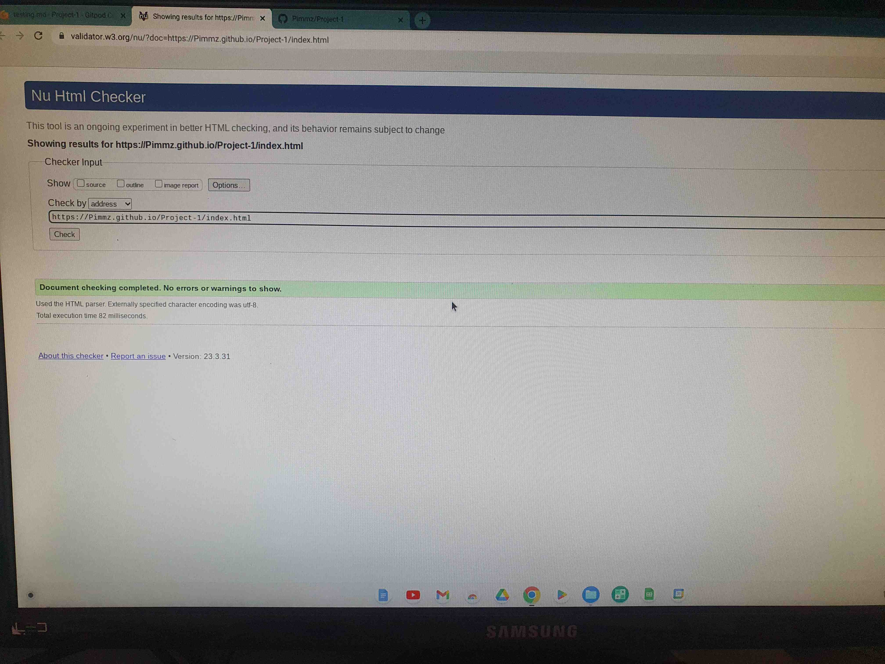

Walkies Testing 

Return back to the [README.md](README.md) file.

To ensure that Walkies works effectively over a number of sites and devices, I have prepared details and screenshots for you see.

Code Validation (Ask Tim)

⚠️⚠️⚠️⚠️⚠️ START OF NOTES (to be deleted) ⚠️⚠️⚠️⚠️⚠️

Use the space to discuss code validation for any of your own code files (where applicable).
You are not required to validate external libraries/frameworks, such as imported Bootstrap, Materialize, Font Awesome, etc.

**IMPORTANT**: You must provide a screenshot for each file you validate.

**PRO TIP**: Always validate the live site pages, not your local code. There could be subtle/hidden differences.

🛑🛑🛑🛑🛑 END OF NOTES (to be deleted) 🛑🛑🛑🛑🛑

HTML Validation

I have used the recommended [HTML W3C Validator](https://validator.w3.org) to validate all of my HTML files.

Below is a link for you too see live that my code is valid plus I have enlocsed a screenshot in case for some reason that fails;

| Page | W3C URL | Screenshot | Notes |
| --- | --- | --- | --- |
| Home | [W3C](https://validator.w3.org/nu/?doc=https%3A%2F%2FPimmz.github.io%2FProject-1%2Findex.html) |

| Services | [W3C](https://validator.w3.org/nu/?doc=https%3A%2F%2FPimmz.github.io%2FProject-1%2Fservices.html) [screenshot](documentation/W3validator-reviewscreen.jpg) 

| Contact | [W3C](https://validator.w3.org/nu/?doc=https%3A%2F%2FPimmz.github.io%2FProject-1%2Fcontact.html) | [screenshot](documentation/W3validator-reviewscreen.jpg}

| Review | [W3C](https://validator.w3.org/nu/?doc=https%3A%2F%2FPimmz.github.io%2FProject-1%2Freviews.html) | [screenshot](documentation/W3validator-reviewscreen.jpg}

|  Errors |
| Add Blog | n/a |  | Duplicate IDs found, and fixed |
| Checkout | n/a |  | Pass: No Errors |
| x | x | x | repeat for all remaining HTML files |

XXXXXXXXXXXXXXXXXXXXXXXXXXXXXXXXXXXXXXXXXXXXXXXXXXXXXXXXXXXX

CSS Validation

Below is a link for you too see live that my code is valid plus I have enlocsed a screenshot in case for some reason that fails;

| Page | W3C URL | Screenshot | Notes |
| --- | --- | --- | --- |
| Home | [W3C](- https://jigsaw.w3.org/css-validator/validator?uri=https%3A%2F%2FPimmz.github.io%2FProject-1) [screenshot](documentation/  put screenshot here jpg)|

Error
[screenshot](documentation/css-error.jpg) px was missing on line 288 and 292, now fixed

If you have multiple CSS files, then individual [validation by input](https://jigsaw.w3.org/css-validator/#validate_by_input)
is recommended for the additional CSS files.

Browser capability and Responsiveness

I have tested Walkies on three different browsers. The first was chrome, the second was Firefox and the third was Safari

- [Chrome](https://www.google.com/chrome)

- [Firefox](https://www.mozilla.org/firefox)

- [Safari](https://support.apple.com/downloads/safari)

I've tested my deployed project on multiple browsers to check for compatibility issues. To ensure that all are working correctly I have also tested for responsivness on desktop, tablet and mobile 

| Browser | Screenshot | Notes |
| --- | --- | --- |
| Chrome Desktop| [screenshot](documentation/ Put screen shot here) ) | Works as expected |
| Chrome Tablet|
| Chrome Mobile

| Firefox Desktop| [screenshot](documentation/ Put screen shot here)  | Works as expected |
| Firefox Tablet|
| Firefox Mobile|

| Safari Desktop| [screenshot](documentation/ Put screen shot here) |
| Safari Desktop|
| Safari Desktop|

To be completely thorough I have tested Walkies on the below devices.

| Device | Screenshot | Notes |
| --- | --- | --- |
| Mobile (DevTools) |  | Works as expected |
| Tablet (DevTools) |  | Works as expected |
| Desktop |  | Works as expected |
| XL Monitor |  | Scaling starts to have minor issues |
| 4K Monitor |  | Noticeable scaling issues |
| Google Pixel 7 Pro |  | Works as expected |
| iPhone 14 |  | Works as expected |
| x | x | repeat for any other tested sizes |

Lighthouse Audit

I've tested my deployed project using the Lighthouse Audit tool to check for any major issues I have enclosed the following screenshot to show as my evidence.

| Page | Size | Screenshot | Notes |
| --- | --- | --- | --- |
| Home | Mobile |  | Some minor warnings |
| Home | Desktop |  | Few warnings |
| About | Mobile |  | Some minor warnings |
| About | Desktop |  | Few warnings |
| Gallery | Mobile |  | Slow response time due to large images |
| Gallery | Desktop |  | Slow response time due to large images |
| x | x | x | repeat for any other tested pages/sizes |

## Bugs

⚠️⚠️⚠️⚠️⚠️ START OF NOTES (to be deleted) ⚠️⚠️⚠️⚠️⚠️

It's very important to document any bugs you've discovered while developing the project.
Make sure to include any necessary steps you've implemented to fix the bug(s) as well.

**PRO TIP**: screenshots of bugs are extremely helpful, and go a long way!

🛑🛑🛑🛑🛑 END OF NOTES (to be deleted) 🛑🛑🛑🛑🛑

- JS Uncaught ReferenceError: `foobar` is undefined/not defined

    

    - To fix this, I _____________________.

- JS `'let'` or `'const'` or `'template literal syntax'` or `'arrow function syntax (=>)'` is available in ES6 (use `'esversion: 11'`) or Mozilla JS extensions (use moz).

    

    - To fix this, I _____________________.

- Python `'ModuleNotFoundError'` when trying to import module from imported package

    

    - To fix this, I _____________________.

- Django `TemplateDoesNotExist` at /appname/path appname/template_name.html

    

    - To fix this, I _____________________.

- Python `E501 line too long` (93 > 79 characters)

    

    - To fix this, I _____________________.

### GitHub **Issues**

⚠️⚠️⚠️⚠️⚠️ START OF NOTES (to be deleted) ⚠️⚠️⚠️⚠️⚠️

An improved way to manage bugs is to use the built-in **Issues** tracker on your GitHub repository.
To access your Issues, click on the "Issues" tab at the top of your repository.
Alternatively, use this link: https://github.com/Pimmz/Project-1/issues

If using the Issues tracker for your bug management, you can simplify the documentation process.
Issues allow you to directly paste screenshots into the issue without having to first save the screenshot locally,
then uploading into your project.

You can add labels to your issues (`bug`), assign yourself as the owner, and add comments/updates as you progress with fixing the issue(s).

Once you've sorted the issue, you should then "Close" it.

When showcasing your bug tracking for assessment, you can use the following format:

🛑🛑🛑🛑🛑 END OF NOTES (to be deleted) 🛑🛑🛑🛑🛑

**Fixed Bugs**

All previously closed/fixed bugs can be tracked [here](https://github.com/Pimmz/Project-1/issues?q=is%3Aissue+is%3Aclosed).

| Bug | Status |
| --- | --- |
| [JS Uncaught ReferenceError: `foobar` is undefined/not defined](https://github.com/Pimmz/Project-1/issues/1) | Closed |
| [Python `'ModuleNotFoundError'` when trying to import module from imported package](https://github.com/Pimmz/Project-1/issues/2) | Closed |
| [Django `TemplateDoesNotExist` at /appname/path appname/template_name.html](https://github.com/Pimmz/Project-1/issues/3) | Closed |

**Open Issues**

Any remaining open issues can be tracked [here](https://github.com/Pimmz/Project-1/issues).

| Bug | Status |
| --- | --- |
| [JS `'let'` or `'const'` or `'template literal syntax'` or `'arrow function syntax (=>)'` is available in ES6 (use `'esversion: 11'`) or Mozilla JS extensions (use moz).](https://github.com/Pimmz/Project-1/issues/4) | Open |
| [Python `E501 line too long` (93 > 79 characters)](https://github.com/Pimmz/Project-1/issues/5) | Open |

## Unfixed Bugs

⚠️⚠️⚠️⚠️⚠️ START OF NOTES (to be deleted) ⚠️⚠️⚠️⚠️⚠️

You will need to mention unfixed bugs and why they were not fixed.
This section should include shortcomings of the frameworks or technologies used.
Although time can be a big variable to consider, paucity of time and difficulty understanding
implementation is not a valid reason to leave bugs unfixed.

If you've identified any unfixed bugs, no matter how small, be sure to list them here.
It's better to be honest and list them, because if it's not documented and an assessor finds the issue,
they need to know whether or not you're aware of them as well, and why you've not corrected/fixed them.

Some examples:

🛑🛑🛑🛑🛑 END OF NOTES (to be deleted) 🛑🛑🛑🛑🛑

- On devices smaller than 375px, the page starts to have `overflow-x` scrolling.

    

    - Attempted fix: I tried to add additional media queries to handle this, but things started becoming too small to read.

- For PP3, when using a helper `clear()` function, any text above the height of the terminal does not clear, and remains when you scroll up.

    

    - Attempted fix: I tried to adjust the terminal size, but it only resizes the actual terminal, not the allowable area for text.

- When validating HTML with a semantic `section` element, the validator warns about lacking a header `h2-h6`. This is acceptable.

    

    - Attempted fix: this is a known warning and acceptable, and my section doesn't require a header since it's dynamically added via JS.

⚠️⚠️⚠️⚠️⚠️ START OF NOTES (to be deleted) ⚠️⚠️⚠️⚠️⚠️

If you legitimately cannot find any unfixed bugs or warnings, then use the following sentence:

🛑🛑🛑🛑🛑 END OF NOTES (to be deleted) 🛑🛑🛑🛑🛑

There are no remaining bugs that I am aware of.